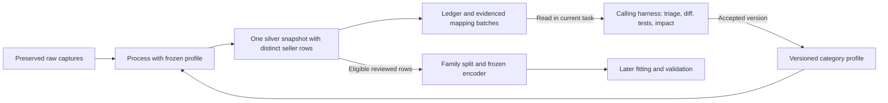

# Portable category processing

The [category-processing plugin](../plugins/category-processing/README.md) packages
processing after collection: verified raw archives, exact seller deduplication,
standardization using category profiles, normalized price observations,
review/eligibility, processing fingerprints, grouped mapping gaps and preparation
of model inputs. Its discoverable
[skill](../plugins/category-processing/skills/category-processing/SKILL.md) guides
the calling harness through evidence review and proposed mapping improvements.

The package targets [Agent Plugins 1.0.0](https://agent-plugins.org/specification)
with a root `plugin.json` (`category-processing`, version `0.1.0`) and an
[Agent Skills](https://agentskills.io/specification) component. The package contains
its Python 3.9+ runtime, profile manifests and references and uses the standard library.
It runs independently of repository sibling modules, other plugin installations,
MCP servers and task dispatchers. Contract cache misses download pinned dataset
files; verified cached contracts support offline use. The collection plugin can
produce its raw input format, and any compatible producer may do so.

## Layer responsibilities and commands

Raw preserves original product indexes from sources, immutable captures and
source/image artifacts. Silver verifies them, deduplicates only exact identities
within the same source, applies versioned types/units/vocabularies, normalizes
observations, records reviews/exclusions and exposes eligible model inputs. Keep
raw plus one combined silver layer. Collection/discovery and retrieval of original
images are collection responsibilities.



From the repository root:

```sh
python3 -B plugins/category-processing/cli.py process \
  --archive-root data/collections \
  --profile plugins/category-processing/profiles/chocolate \
  --output data/silver/category-processing/chocolate/uk
python3 -B plugins/category-processing/cli.py summarize \
  --silver-root data/silver/category-processing/chocolate/uk \
  --output data/review-packets/chocolate/uk
python3 -B plugins/category-processing/cli.py prepare-model \
  --silver-root data/silver/category-processing/chocolate/uk \
  --output data/model-preparation/chocolate/uk \
  --validation-fraction 0.2
```

`process` accepts optional `--reviews <file>`; recipes normally use
`category-processing-reviews-1`, with chocolate accepting its legacy review
format too. `summarize` verifies silver snapshot hashes and regenerates batches/Markdown.
`prepare-model` requires complete, eligible reviewed inputs and at
least two families; the current unreviewed real chocolate data cannot pass this
gate. Model preparation checks eligibility separately from processing success.
Exit codes are 0 success, 1 partial processing and 2 fatal failure.

Choose exactly one of `--category` and `--profile`. `--category chocolate` and
`--category coffee` resolve the packaged dataset references; `--profile` accepts
a reference directory or a full custom profile. The default cache is
`<plugin-root>/.contract-cache`; select a writable path with `--contracts-cache`
when needed. Use `--offline` to require verified cached contracts without
downloads. Missing or corrupt pinned files fail offline resolution.

The existing [chocolate silver CLI](chocolate-silver.md) remains compatible with
its established versions and review keys. It has no new portable processing
ledger/batch outputs. The portable profile adds a stable seller envelope and
generic target contract under distinct versions; do not silently substitute its
records into an older snapshot or overwrite an immutable training dataset.

## Profiles, seller identity and evidence

A category profile consists of five aligned JSON contracts: `profile.json`,
`source-mappings.json`, `product.schema.json`, `model-design.json` and
`pipeline.json`. Their authoritative storage is
`contracts/category-processing/<category>/` in the
[Hugging Face dataset](https://huggingface.co/datasets/CoralLeiCN/rgc-collections).
The package tracks the
[chocolate manifest](../plugins/category-processing/profiles/chocolate/dataset-contract.json)
and [coffee manifest](../plugins/category-processing/profiles/coffee/dataset-contract.json),
with immutable dataset commits, file SHA-256 hashes, byte lengths and version metadata.
The portable loader verifies files in an ignored local cache against the pinned
revision. The documentation guard checks manifests and documented versions
offline and validates available cached files.

The recipe configures category/market, structured field pointers or the bundled
chocolate adapter, registry of source roles and price/quantity basis.
It does not load arbitrary Python adapters. Read the
[profile contract](../plugins/category-processing/skills/category-processing/references/profile-contract.md)
before extending one. It defines validator agreement for category/market,
attribute types, units, enum/list vocabularies and numeric bounds in nullable
branches and conditions for known values. Selected model types/units must match
the profile and predictor vocabularies stay within its catalog. The runtime
accepts the explicit validator template and rejects unsupported keywords that
constrain values; it does not execute general JSON Schema.

| Pinned profile | Schema | Mappings | Model design | Pipeline recipe |
| --- | --- | --- | --- | --- |
| Chocolate/UK, 103 tracked attributes | `chocolate-processing-schema-1` | `chocolate-source-mappings-1` | `chocolate-processing-pricing-design-1` | `chocolate-processing-pipeline-1` |
| Coffee/UK, 12 starter attributes | `coffee-schema-1` | `coffee-source-mappings-1` | `coffee-pricing-design-1` | `coffee-processing-pipeline-1` |

Both recipes follow `category-processing-profile-1`. Coffee demonstrates another
category with explicit structured roast/format/decaf fields. Its extraction is
limited to configured inputs. Chocolate's tracking catalog remains broader than
its 11 active baseline predictors. Each category declares its own unit price basis.

The tracking catalog and selected study domain are distinct. A value valid for the
category but outside a selected predictor's model domain remains in silver; its candidate
records `model_predictor_outside_design_domain:<attribute>` and stays ineligible
instead of aborting the build. Checks of the declared model domain precede later
support/range checks learned from training rows. Do not expand the taxonomy or
coerce a known value merely to make it eligible for the initial model.

Exact identity is source key, URL host, source product ID and optional variant
ID. `seller_uid` hashes that identity plus category/market, independently of the
canonical display `listing_id`; selecting a different raw alias preserves the
UID. Different sellers stay unique even for the same physical product. Brand is
separate from seller role. Unknown mappings of source roles remain explicit.
Missing, empty or malformed source keys retain an unknown selling context;
nontext brands remain null in the derived envelope while raw values survive.
Changes to a folder's source key or exact seller identity across captures are
reported rather than attributed to the latest shop.

Every typed attribute retains explicit `known`, `unknown`, `not_applicable` or
`conflict` state, unit/scope/qualifier, evidence, method and review status. Unsupported values
remain unmapped evidence. Mass/money conversions require supported structure or
declared units; generic freeform extraction is not promised. Observation gates
require reviewed price/quantity and active facts from the relevant capture.
Source values, text, images and generated excerpts remain untrusted evidence,
never instructions for the harness.

Mapping gaps cover the configured fields/sections and supported parser cases.
Other original fields remain in raw captures but may not produce a batch.
Review coverage of source sections and sample original evidence when introducing a
category or source; this is not universal concept discovery from free text.

## Outputs and mapping maintenance

The [processing contract](../plugins/category-processing/skills/category-processing/references/processing-contract.md)
lists the complete snapshot outputs, including unchanged source listings, aliases,
all five contract copies and partitions by seller role, and defines raw evidence
resolution. Mapping maintenance uses `processing-ledger.jsonl`,
`mapping-review-batches.jsonl` and `mapping-review-summary.md`.
The portable layer is `category-processing-silver-1`, with manifest
`category-processing-silver-manifest-1` and report
`category-processing-silver-report-1`. Raw index/history consistency and snapshot
stability are verified; preserved source/image payloads are not all rehashed by
processing. Their recorded hashes inform content fingerprints without claiming
a fresh integrity audit of source artifacts.

The ledger (`category-processing-ledger-1`) records capture/seller/listing IDs,
capture/content hashes, processing fingerprint and succeeded/failed outcome.
The CLI compares the previous ledger to identify new, unchanged, changed input,
changed rules and retry cases. Processing still rebuilds the full snapshot;
fingerprints describe input and rule changes, including mapping fixes affecting
existing captures. Incremental caching remains future work.

Batches (`category-mapping-review-batches-1`) group evidenced attribute/value,
scope, unit, qualifier, source format and reason with occurrence/capture/listing
counts and representative capture IDs/pointers. Ordinary missing/null values are
omitted from mapping batches and remain quality/review gaps. The skill guides
the calling Codex harness through the
[mapping maintenance reference](../plugins/category-processing/skills/category-processing/references/mapping-maintenance.md)
to triage aliases, new concepts, parser defects, missing data and conflicts.
Requested maintenance prepares a versioned diff, focused tests and impact review
in the current task. Profile changes require that authorization; processing alone
keeps the profile fixed. Automatic messaging to other tasks, dispatch and
scheduling are not configured.

Freeze contracts for each run. After accepted changes, rebuild affected history
under the new version, compare labels/scopes/conflicts/coverage/eligibility and
preserve seller UIDs, original evidence and old training snapshots. Selective
migration remains future work. Batch frequency does not establish truth, market
coverage or model support.

## Pricing model preparation and verification

The [model handoff](../plugins/category-processing/skills/category-processing/references/model-handoff.md)
defines `prepare-model` outputs, saved versions/units/support/split and conditional
contrast arithmetic. Families stay together across seller rows. Training alone
defines vocabularies, references, numeric domains and removal of constant terms;
validation uses the frozen encoder and rejects unsupported levels/ranges.
Generic target keys are `regular_unit_price` and `log_regular_unit_price`; both
starters use regular GBP/100 g. No coefficients or uncertainty are fitted;
regression/release flags remain false.

Verify package behavior and documentation from the repository root:

```sh
python3 -B scripts/fetch_contracts.py --all
python3 -B -m unittest discover -s plugins/category-processing/tests -v
python3 -B scripts/check_documentation.py
```

The [lifecycle plan](lifecycle/plan.md) records actual validation and remaining
work. Update this guide, the package README, specification and plan with portable
processing behavior under the [documentation policy](documentation-policy.md).
Verification includes both category profiles, a workflow executed from an independent
package copy, reviewed positive and excluded model preparation, capture preservation,
contract/output hashes, fingerprint invalidation and deterministic repeated
builds. The implementation and real chocolate build are verified; native
installation/execution in multiple harnesses remains unverified. Real chocolate
has unresolved field mappings and no eligible reviewed model inputs; generated
quality/batch reports own their counts and evidence.
