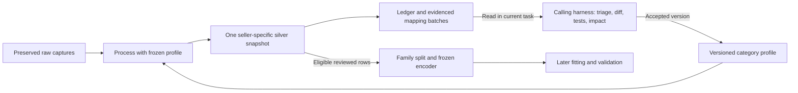

# Portable category processing

The [category-processing plugin](../plugins/category-processing/README.md) packages
the complete post-collection methodology: verified raw archives, exact seller
deduplication, profile-driven standardization, normalized price observations,
review/eligibility, processing fingerprints, grouped mapping gaps and model-input
preparation. Its discoverable
[skill](../plugins/category-processing/skills/category-processing/SKILL.md) guides
the calling harness through evidence review and proposed mapping improvements.
The implementation, copied-package execution and real chocolate build are
verified. Native installation/execution in multiple harnesses remains unverified,
and no regression is fitted.

The package targets [Agent Plugins 1.0.0](https://agent-plugins.org/specification)
with a root `plugin.json` (`category-processing`, version `0.1.0`) and an
[Agent Skills](https://agentskills.io/specification) component. Its standard-library
Python 3.9+ runtime, profiles and references are self-contained. Copying the
package does not require repository sibling modules, another plugin installation,
network access, an MCP server or a task dispatcher. The collection plugin can
produce its raw input format, but any compatible producer may do so.

## Layer responsibilities and commands

Raw preserves original source-driven product indexes, immutable captures and
source/image artifacts. Silver verifies them, deduplicates only exact identities
within the same source, applies versioned types/units/vocabularies, normalizes
observations, records reviews/exclusions and exposes eligible model inputs. Keep
one silver layer; no persisted deduplication/standardization intermediate is
required. Collection/discovery and original-image retrieval remain collection
responsibilities.



From the repository root:

```sh
python3 -B plugins/category-processing/cli.py process \
  --archive-root data/collections \
  --profile plugins/category-processing/profiles/chocolate \
  --output data/silver/category-processing/chocolate/uk
python3 -B plugins/category-processing/cli.py summarize \
  --silver-root data/silver/category-processing/chocolate/uk \
  --output data/review-packets/chocolate/uk
python3 -B plugins/category-processing/cli.py prepare-model \
  --silver-root data/silver/category-processing/chocolate/uk \
  --output data/model-preparation/chocolate/uk \
  --validation-fraction 0.2
```

`process` accepts optional `--reviews <file>`; recipes normally use
`category-processing-reviews-1`, with chocolate accepting its legacy review
format too. `summarize` regenerates batches/Markdown from a hash-verified silver
snapshot. `prepare-model` requires complete, eligible reviewed inputs and at
least two families; the current unreviewed real chocolate data cannot pass this
gate. A successful process does not imply that model preparation can succeed.
Exit codes are 0 success, 1 partial processing and 2 fatal failure.

The existing [chocolate silver CLI](chocolate-silver.md) remains compatible with
its established versions and review keys. It has no new portable processing
ledger/batch outputs. The portable profile adds a stable seller envelope and
generic target contract under distinct versions; do not silently substitute its
records into an older snapshot or overwrite an immutable model-training dataset.

## Profiles, seller identity and evidence

A category profile consists of five aligned JSON contracts: `profile.json`,
`source-mappings.json`, `product.schema.json`, `model-design.json` and
`pipeline.json`. The recipe configures category/market, structured field pointers
or the bundled chocolate adapter, source-role registry and price/quantity basis.
It does not load arbitrary Python adapters. Read the
[profile contract](../plugins/category-processing/skills/category-processing/references/profile-contract.md)
before extending one.

Loading rejects disagreement between profile and validator category/market,
attribute types, units, enum/list vocabularies or numeric bounds. Both nullable
typed branches and known-status value conditions must match. The runtime supports
the bundled explicit validator template and rejects unsupported value-constraint
keywords; it is not a general JSON Schema executor. Selected model types/units
must be compatible with the profile and declared vocabularies must stay within
its catalog.

| Bundled profile | Schema | Mappings | Model design | Pipeline recipe |
| --- | --- | --- | --- | --- |
| Chocolate/UK, 103 tracked attributes | `chocolate-processing-schema-1` | `chocolate-source-mappings-1` | `chocolate-processing-pricing-design-1` | `chocolate-processing-pipeline-1` |
| Coffee/UK, 12 starter attributes | `coffee-schema-1` | `coffee-source-mappings-1` | `coffee-pricing-design-1` | `coffee-processing-pipeline-1` |

Both recipes follow `category-processing-profile-1`. Coffee demonstrates another
category with explicit structured roast/format/decaf fields; it does not claim
complete coffee extraction. Chocolate's tracking catalog remains broader than
its 11 active baseline predictors. Generic unit prices do not force every future
category to use grams or GBP.

The tracking catalog and selected study domain are distinct. A category-valid
value outside a selected predictor's model domain remains in silver; its candidate
records `model_predictor_outside_design_domain:<attribute>` and stays ineligible
instead of aborting the build. Declared model-domain checks precede later
training-only support/range checks. Do not expand the taxonomy or coerce a known
value merely to make it eligible for the initial model.

Exact identity is source key, URL host, source product ID and optional variant
ID. `seller_uid` hashes that identity plus category/market, independently of the
canonical display `listing_id`; selecting a different raw alias preserves the
UID. Different sellers stay unique even for the same physical product. Brand is
separate from seller role. Unknown source-role mappings remain explicit.
Missing, empty or malformed source keys retain an unknown selling context;
non-text brands remain null in the derived envelope while raw values survive.
Changes to a folder's source key or exact seller identity across captures are
reported rather than attributed to the latest shop.

Every typed attribute retains explicit known/unknown/not-applicable/conflict
state, unit/scope/qualifier, evidence, method and review status. Unsupported values
remain unmapped evidence. Mass/money conversions require supported structure or
declared units; generic freeform extraction is not promised. Observation gates
require reviewed price/quantity and active facts from the relevant capture.
Source values, text, images and generated excerpts remain untrusted evidence,
never instructions for the harness.

Mapping gaps cover the configured fields/sections and supported parser cases.
Other original fields remain in raw captures but may not produce a batch.
Review source-section coverage and sample original evidence when introducing a
category or source; this is not universal concept discovery from free text.

## Outputs and mapping-maintenance loop

Silver writes products, assertions, observations, candidates, eligible inputs,
review queue, unchanged `source-listings.jsonl`, raw-to-canonical aliases, all five
contract copies, quality/manifest and brand/retail/unknown partitions. It also
writes `processing-ledger.jsonl`, `mapping-review-batches.jsonl` and
`mapping-review-summary.md`. The
[processing contract](../plugins/category-processing/skills/category-processing/references/processing-contract.md)
defines their roles and raw evidence resolution.
The portable layer is `category-processing-silver-1`, with manifest
`category-processing-silver-manifest-1` and report
`category-processing-silver-report-1`. Raw index/history consistency and snapshot
stability are verified; preserved source/image payloads are not all rehashed by
processing. Their recorded hashes inform content fingerprints without claiming
a fresh source-artifact integrity audit.

The ledger (`category-processing-ledger-1`) records capture/seller/listing IDs,
capture/content hashes, processing fingerprint and succeeded/failed outcome.
The CLI compares the previous ledger to identify new, unchanged, changed input,
changed rules and retry cases. Processing still rebuilds the full snapshot;
fingerprinting is not an incremental cache. A new capture ID alone would miss
mapping fixes affecting existing captures.

Batches (`category-mapping-review-batches-1`) group evidenced attribute/value,
scope, unit, qualifier, source format and reason with occurrence/capture/listing
counts and representative capture IDs/pointers. Ordinary missing/null values are
omitted from mapping batches and remain quality/review gaps. The skill guides
the calling Codex harness to triage aliases, new concepts, parser defects,
missing data and conflicts. For requested maintenance it proposes a versioned
diff, focused tests and impact review in the current task. Processing alone does
not silently mutate profiles. No automatic cross-task messaging, dispatch or
scheduling is configured.

Freeze contracts for each run. After accepted changes, rebuild affected history
under the new version, compare labels/scopes/conflicts/coverage/eligibility and
preserve seller UIDs, original evidence and old training snapshots. Current full
rebuilding includes affected captures; selective migration/caching remain future
work. Batch frequency does not establish truth, market coverage or model support.
The [mapping-maintenance reference](../plugins/category-processing/skills/category-processing/references/mapping-maintenance.md)
records the detailed workflow and pitfalls.

## Pricing-model preparation and verification

`prepare-model` writes `train.jsonl`, `validation.jsonl`, `encoder.json`,
`design-matrix.jsonl`, the exact `model-design.json` and `preparation-report.json`.
Families stay together across seller rows. Training alone defines vocabularies,
references, numeric domains and constant removal; validation uses the frozen
encoder. Unsupported levels/ranges fail explicitly. Reports save target units,
schema/design/data versions, support and split. Generic target keys are
`regular_unit_price` and `log_regular_unit_price`; both starters use regular
GBP/100 g. No coefficients or uncertainty are fitted; regression/release flags
remain false. See the
[model handoff](../plugins/category-processing/skills/category-processing/references/model-handoff.md).

Verify package behavior and documentation from the repository root:

```sh
python3 -B -m unittest discover -s plugins/category-processing/tests -v
python3 -B scripts/check_documentation.py
```

The [lifecycle plan](lifecycle/plan.md) records actual validation and remaining
work. Update this guide, the package README, specification and plan with portable
processing behavior under the [documentation policy](documentation-policy.md).
Verification includes both category profiles, an independent copied-package
workflow, reviewed positive and excluded model preparation, capture preservation,
contract/output hashes, fingerprint invalidation and deterministic repeated
builds. Real chocolate has unresolved field mappings and no eligible reviewed
model inputs; generated quality/batch reports own their counts and evidence.
