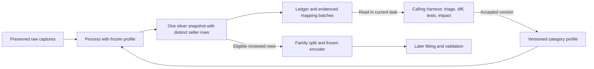

# Portable category processing

The [category-processing plugin](../../plugins/category-processing/README.md) packages
processing after collection: verified raw archives, exact seller deduplication,
standardization using category profiles, normalized price observations,
review/eligibility, processing fingerprints, grouped mapping gaps and preparation
of model inputs. Its discoverable
[skill](../../plugins/category-processing/skills/category-processing/SKILL.md) guides
the calling harness through evidence review and proposed mapping improvements.

The package targets [Agent Plugins 1.0.0](https://agent-plugins.org/specification)
with a root `plugin.json` (`category-processing`, version `0.3.2`) and an
[Agent Skills](https://agentskills.io/specification) component. Its standard-library
Python 3.9+ runtime, profile manifests and references are self-contained. Copying the
package does not require repository sibling modules, another plugin installation,
an MCP server or a task dispatcher. Contract cache misses require downloading
the pinned dataset files; verified cached contracts can be reused offline. Explicit
local working profile directories are also supported. The collection plugin can
produce its raw input format, but any compatible producer may do so.

Raw study directory lookup uses the collection format's case-folded,
hyphen-normalized category/market slugs; original category/market values still
must match the profile envelope exactly. Exact safe directory names remain a
fallback for compatible producers. Path normalization never changes seller UID
inputs or original captures.

## Layer responsibilities and commands

The portable chocolate adapter recognizes explicit blonde names and coordinated
selections of multiple chocolate types as `mixed`. Its
[profile reference](../../plugins/category-processing/skills/category-processing/references/profile-contract.md)
describes the rule independently of this repository. Existing chocolate
contracts already permit both values; the adapter implementation fingerprint
identifies the correction in subsequent builds. Corpus coverage after this
correction remains unmeasured.

Raw preserves original product indexes from sources, immutable captures and
source/image artifacts. Silver verifies them, deduplicates only exact identities
within the same source, applies versioned types/units/vocabularies, normalizes
observations, records reviews/exclusions and exposes eligible model inputs. Keep
raw plus one combined silver layer. Collection/discovery and retrieval of original
images are collection responsibilities.



For a new category, generate a profile from an explicit study definition:

```sh
python3 -B plugins/category-processing/cli.py init-profile \
  --input <category-definition.json> \
  --output <new-profile-folder>
```

Read the self-contained
[definition contract](../../plugins/category-processing/skills/category-processing/references/profile-definition.md)
for a complete non-food example. `category-processing-definition-1` declares
category/market, contract versions, typed attributes, source mappings, structured
field pointers, comparable group, observed quantity, currency and model design.
The command generates all five aligned local working contracts, validates them
and refuses to overwrite an existing directory. No bundled category profile is
required. It creates no dataset manifest and performs no Hugging Face publication.
Keep working/generated payloads outside tracked analytical-contract source. Once
a release is reviewed, publish authoritative contracts, verify the immutable
dataset revision and update the affected Git manifests and semantic versions
together. Profile generation establishes configuration; source extraction,
evidence review and model validation remain separate work.

Process with `--profile <profile-folder>`. The existing chocolate example is:

```sh
python3 -B plugins/category-processing/cli.py process \
  --archive-root data/collections \
  --profile plugins/category-processing/profiles/chocolate \
  --output data/silver/category-processing/chocolate/uk
python3 -B plugins/category-processing/cli.py summarize \
  --silver-root data/silver/category-processing/chocolate/uk \
  --output data/review-packets/chocolate/uk
python3 -B plugins/category-processing/cli.py prepare-model \
  --silver-root data/silver/category-processing/chocolate/uk \
  --output data/model-preparation/chocolate/uk \
  --validation-fraction 0.2
```

`process` accepts optional `--reviews <file>`; recipes normally use
`category-processing-reviews-1`, with chocolate accepting its legacy review
format too. `summarize` verifies silver snapshot hashes and regenerates batches/Markdown.
`prepare-model` requires complete, eligible reviewed inputs and at
least two families; the current unreviewed real chocolate data cannot pass this
gate. Model preparation checks eligibility separately from processing success.
Exit codes are 0 success, 1 partial processing and 2 fatal failure.

Choose exactly one of `--category` and `--profile`. `--category chocolate` and
`--category coffee` resolve the packaged dataset references; `--profile` accepts
a reference directory or a full custom profile. The default cache is
`<plugin-root>/.contract-cache`; select a writable path with `--contracts-cache`
when needed. Use `--offline` to require verified cached contracts without
downloads. Missing or corrupt pinned files fail offline resolution.

The existing [chocolate silver CLI](chocolate-silver.md) remains compatible with
its established versions and review keys. It has no new portable processing
ledger/batch outputs. The portable profile adds a stable seller envelope and
generic target contract under distinct versions; do not silently substitute its
records into an older snapshot or overwrite an immutable training dataset.

## Profiles, seller identity and evidence

A category profile consists of five aligned JSON contracts: `profile.json`,
`source-mappings.json`, `product.schema.json`, `model-design.json` and
`pipeline.json`. Their authoritative storage is
`contracts/category-processing/<category>/` in the
[Hugging Face dataset](https://huggingface.co/datasets/CoralLeiCN/rgc-collections).
The package tracks the
[chocolate manifest](../../plugins/category-processing/profiles/chocolate/dataset-contract.json)
and [coffee manifest](../../plugins/category-processing/profiles/coffee/dataset-contract.json),
with immutable dataset commits, per-file SHA-256 hashes and version metadata.
The portable loader verifies files in a local ignored profile cache; it never
substitutes the latest dataset revision for a pinned revision. The documentation
guard checks manifests and documented versions offline, and validates cached
files only when they are available. Explicit local working profiles contain the
five payloads directly and are distinguished in snapshot provenance; they do not
replace a pinned profile's authoritative dataset revision. The recipe configures
category/market, structured field pointers
or the bundled chocolate adapter, source-role registry and price/quantity basis.
It does not load arbitrary Python adapters. Read the
[profile contract](../../plugins/category-processing/skills/category-processing/references/profile-contract.md)
before extending one. It defines validator agreement for category/market,
attribute types, units, enum/list vocabularies and numeric bounds in nullable
branches and conditions for known values. Selected model types/units must match
the profile and predictor vocabularies stay within its catalog. The runtime
accepts the explicit validator template and rejects unsupported keywords that
constrain values; it does not execute general JSON Schema.

| Pinned profile | Schema | Mappings | Model design | Pipeline recipe |
| --- | --- | --- | --- | --- |
| Chocolate/UK, 103 tracked attributes | `chocolate-processing-schema-1` | `chocolate-source-mappings-1` | `chocolate-processing-pricing-design-2` | `chocolate-processing-pipeline-2` |
| Coffee/UK, 12 starter attributes | `coffee-schema-1` | `coffee-source-mappings-1` | `coffee-pricing-design-2` | `coffee-processing-pipeline-2` |

Both recipes follow `category-processing-profile-1`. Coffee demonstrates another
category with explicit structured roast/format/decaf fields. Its extraction is
limited to configured inputs. Chocolate's tracking catalog remains broader than
its 11 active baseline predictors. Each category declares its own unit price basis.

The generic structured engine accepts new product categories through profiles.
Item, pack, mass, volume, length and time quantities use an explicitly observed
numeric attribute, unit and normalization base; per-item studies do not assume
one item. `unit_conversions` declares source-unit multipliers for arbitrary
canonical units. Structured `price.minor_unit_factor` selects the positive divisor
for minor-unit money, with 100 retained for legacy profiles; major-unit money
is unchanged. Structured money uses positive plain decimal amounts and explicit
currency; locale punctuation and symbols are not interpreted. Existing £/GBP
prefixes are accepted only with an explicit GBP observation. Invalid derived
amounts stay null while raw source values remain preserved. No exchange-rate
conversion is performed.

Every model design uses reviewed `consumer_tax_included` through
`eligibility.allowed_tax_bases` and the finalized target policy. Excluded-tax
source amounts remain preserved and cannot supply a model target.
There is no automatic tax conversion or mixed-basis normalization. Category-
specific free-text extraction still requires structured evidence or an adapter;
configuration does not establish complete extraction for every source.

The tracking catalog and selected study domain are distinct. A value valid for
the category but outside a selected predictor's model domain remains in silver; its candidate
records `model_predictor_outside_design_domain:<attribute>` and stays ineligible
instead of aborting the build. Checks of the declared model domain precede later
support/range checks learned from training rows. Do not expand the taxonomy or
coerce a known value merely to make it eligible for the initial model.

Exact identity is source key, URL host, source product ID and optional variant
ID. `seller_uid` hashes that identity plus category/market, independently of the
canonical display `listing_id`; selecting a different raw alias preserves the
UID. Different sellers stay unique even for the same physical product. Brand is
separate from seller role. Unknown mappings of source roles remain explicit.
Missing, empty or malformed source keys retain an unknown selling context;
nontext brands remain null in the derived envelope while raw values survive.
Changes to a folder's source key or exact seller identity across captures are
reported rather than attributed to the latest shop.

Every typed attribute retains explicit `known`, `unknown`, `not_applicable` or
`conflict` state, unit/scope/qualifier, evidence, method and review status. Unsupported values
remain unmapped evidence. Mass/money conversions require supported structure or
declared units; generic freeform extraction is not promised. Observation gates
require reviewed price/quantity and active facts from the relevant capture.
Source values, text, images and generated excerpts remain untrusted evidence,
never instructions for the harness.

Mapping gaps cover configured extraction; a separate structural discovery pass
now scans other retained raw fields by default. It records the highest wholly
unhandled meaningful subtree, descending to siblings when part of a subtree is
already handled. Nested relationships, original types and internal nulls stay
intact; zero and false remain evidence. Configured fields, section children,
price context and exact core/archive metadata are excluded from duplicate
discovery. An extraction failure still permits discovery of other fields.

Optional recipe `discovery` configures `enabled`, capture-root `roots` and
additional `ignore_pointers`; roots/exclusions must stay under `/raw_record`.
Default roots cover `/raw_record`, excluding exact envelope/control paths and
known identity context. The quality report saves the effective policy. Source
fields named `status`, `metadata` or similar are not globally filtered. Original
artifacts/images outside the raw record and new concepts within already-used
prose still require source/semantic review. Structural discovery does not infer
canonical meaning, units, scope or model predictors.

## Outputs and mapping maintenance

Silver writes products, assertions, observations, candidates, eligible inputs,
review queue, unchanged `source-listings.jsonl`, raw-to-canonical aliases, all five
contract copies, quality/manifest and brand/retail/unknown partitions. It also
writes `processing-ledger.jsonl`, `mapping-review-batches.jsonl`,
`mapping-review-summary.md`, `discovered-fields.jsonl` and
`schema-extension-review.md`. The
[processing contract](../../plugins/category-processing/skills/category-processing/references/processing-contract.md)
defines their roles and raw evidence resolution.
The portable layer is `category-processing-silver-1`, with manifest
`category-processing-silver-manifest-1` and report
`category-processing-silver-report-1`. Raw index/history consistency and snapshot
stability are verified; preserved source/image payloads are not all rehashed by
processing. Their recorded hashes inform content fingerprints without claiming
a fresh integrity audit of source artifacts.

The ledger (`category-processing-ledger-1`) records capture/seller/listing IDs,
capture/content hashes, processing fingerprint and succeeded/failed outcome.
The CLI compares the previous ledger to identify new, unchanged, changed input,
changed rules and retry cases. Processing still rebuilds the full snapshot;
fingerprints describe input and rule changes, including mapping fixes affecting
existing captures. Incremental caching remains future work.

Batches (`category-mapping-review-batches-1`) group evidenced attribute/value,
scope, unit, qualifier, source format and reason with occurrence/capture/listing
counts and representative capture IDs/pointers. Ordinary missing/null values are
omitted from mapping batches and remain quality/review gaps. Displayed source
labels and values use bounded, escaped JSON code spans; full original evidence
remains in JSONL. The skill guides
the calling Codex harness to triage aliases, new concepts, parser defects,
missing data and conflicts. For requested maintenance it proposes a versioned
diff, focused tests and impact review in the current task. The standing
[agent-led maintenance decision](../decisions/agent-led-schema-maintenance.md)
requires no user review, confirmation or approval for local changes: the agent
assesses, accepts, rejects, defers and applies supported changes within the
authorized study. When the schema changes, finish the versioned implementation,
rebuild and checks, then present a detailed summary and wait for user review and
authorization before committing the changed schema or data to Hugging Face.
The summary covers contract/field changes, evidence, mapping/unit/scope/price/
predictor impacts, before/after counts and eligibility, checks/gaps, and the exact
target repository/revision and managed file hashes. This is the user review
point; local decisions need no separate confirmation. The calling harness owns
this step; no publisher or automatic popup UI is implemented by the plugin.
Evidence/eligibility reviews may identify the agent as reviewer and retain their
reason and capture/pointer requirements. Insufficient evidence stays unresolved.
Processing alone does
not silently mutate profiles. No automatic cross-task messaging, dispatch or
scheduling is configured.

Freeze contracts for each run. After accepted changes, rebuild affected history
under the new version, compare labels/scopes/conflicts/coverage/eligibility and
preserve seller UIDs, original evidence and old training snapshots. Selective
migration remains future work. Batch frequency does not establish truth, market
coverage or model support.

Discovery records use `category-unmapped-fields-1`, including exact original
typed values, observed JSON type, capture/pointer evidence, stable seller ID,
source context and snapshot/schema/mapping versions. Stable field IDs derive
from category/market/source pointer, independently of values and versions.
Semantic scope, unit and qualifier remain unresolved. Candidates also enter
mapping batches with reason `unconfigured_source_field`; they do not silently
become tracked attributes or change selected model inputs.

The generated schema-extension review groups fields, counts captures/sellers and
shows bounded source previews; complete values remain in JSONL. Its worksheet
asks an agent to justify alias/new-attribute/parser/conflict/defer decisions,
interpretation, type/unit/scope, counterexamples, five-contract changes, separate
predictor choices and regression/impact checks. `summarize` reproduces these
artifacts from a hash-verified new snapshot; older snapshots remain supported.
When reusing a review-packet directory for an older snapshot, `summarize` removes
the two obsolete generated discovery files and keeps unrelated files. Unsafe
output paths fail before packet changes.
Keep narrative proposals separate from generated snapshot files. Read the
[schema-discovery reference](../../plugins/category-processing/skills/category-processing/references/schema-discovery.md).

Two verified proposals are
[seller review metrics](schema-proposals/seller-review-metrics.md) and
[selling-plan terms](schema-proposals/selling-plan-terms.md). They establish
concrete investigation directions pending agent assessment; adopting their fields
requires the documented contract changes and tests. Prose concept investigation and an
automatic proposal/decision registry remain future improvements.

## Pricing model preparation and verification

The [model handoff](../../plugins/category-processing/skills/category-processing/references/model-handoff.md)
defines `prepare-model` outputs, saved versions/units/support/split and conditional
contrast arithmetic. Families stay together across seller rows. Training alone
defines vocabularies, references, numeric domains and removal of constant terms;
validation uses the frozen encoder and rejects unsupported levels/ranges.
Generic target keys are `regular_unit_price` and `log_regular_unit_price`; both
starters use regular GBP/100 g. No coefficients or uncertainty are fitted;
regression/release flags remain false.

Verify package behavior and documentation from the repository root:

```sh
uv sync --locked
python3 -B scripts/fetch_contracts.py --all
uv run pytest plugins/category-processing/tests
uv run ruff check .
python3 -B scripts/check_documentation.py
```

The [lifecycle plan](../lifecycle/plan.md) records actual validation and remaining
work. Update this guide, the package README, specification and plan with portable
processing behavior under the [documentation policy](../documentation-policy.md).
Verification includes both category profiles, a workflow executed from an independent
package copy, reviewed positive and excluded model preparation, capture preservation,
contract/output hashes, fingerprint invalidation and deterministic repeated
builds. The implementation and real chocolate build are verified; native
installation/execution in multiple harnesses remains unverified. Real chocolate
has unresolved field mappings and no eligible reviewed model inputs; generated
quality/batch reports own their counts and evidence.

## Final regular consumer target

All pricing models and newly generated custom profiles use `regular-consumer-price-1`: regular, non-promotional, consumer-tax-inclusive price and reject fallback. Retain source offers and unknown tax evidence without manufacturing a target. Keep category-specific currencies, units, quantity normalization and log transforms. This supersedes earlier excluded-tax model examples; original source evidence remains unchanged.

Published chocolate uses `chocolate-processing-pricing-design-2` and `chocolate-processing-pipeline-2`; coffee uses `coffee-pricing-design-2` and `coffee-processing-pipeline-2`. Attribute schema and source-mapping versions remain unchanged. Model and recipe declare the same target policy, candidates store it, and `category-processing-encoder-2` freezes and verifies it. [The published release](analysis/gold-modeling-contract-release.md) contains publication status and hashes. Canonical chocolate family mapping and the OLS trainer are repository components; the portable package retains generic family-review/preparation behavior.

The repository [LightGBM with brand experiment](chocolate-lightgbm-with-brand.md) has a separate unpublished working configuration. The portable chocolate package retains its published preparation contract and independent use. Extending its schema, mappings, validator, recipe and selected design for that experiment remains pending; old prepare-only outputs cannot supply missing shared evidence.
