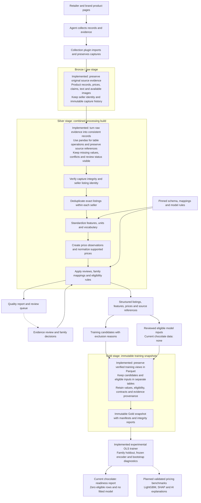

# UK chocolate raw and silver workflow

The chocolate workflow preserves raw evidence, builds one combined silver
dataset, and exports immutable Parquet Gold training snapshots. Silver combines
deduplication within each seller, schema standardization, price normalization,
evidence review and model eligibility in one build.

The [schema guide](chocolate-schema.md) owns the chocolate contract with 103 attributes,
standardization rules, review format and pricing model handoff. The
[project specification](../spec.md) owns requirements across layers and for release.

Machine contracts are authoritative under `contracts/chocolate/` in the
[Hugging Face dataset](https://huggingface.co/datasets/CoralLeiCN/rgc-collections).
The [dataset manifest](../../schemas/chocolate/dataset-contract.json) pins their
immutable revision, versions, file paths and SHA-256 hashes. The build verifies
file byte lengths and hashes under ignored `data/contract-cache/`; a cache miss
requires network access, and verified cached bytes can be reused offline.
Generated silver snapshots retain exact contract copies and their dataset
provenance. Follow [dataset contracts](dataset-contracts.md) for cache resolution
and verification.

## Data flow

The agent gathers product information and source evidence, then the collection
plugin imports those prepared records. Processing reads the preserved raw
archive, builds one combined silver snapshot and exports its training views to
immutable Gold snapshots.

### Stage descriptions

| Stage | Purpose | Data and outputs | Current status |
| --- | --- | --- | --- |
| **Bronze / raw** | Preserve what each source reported so later interpretations can be checked. | Original product records, prices and claims; source text and available images; seller identity and immutable capture history. | Implemented in the raw archive. Bronze is the presentation name for this existing layer. |
| **Silver** | Turn preserved evidence into consistent records while retaining uncertainty and provenance. | Listings deduplicated within each seller, typed features, standardized units, normalized prices, source references, quality reports, review queues and eligibility decisions. | Implemented with pandas. Missing and conflicting values remain visible; current chocolate records still need review before training. |
| **Gold** | Package verified training views in immutable snapshots for model use. | Parquet candidate and eligible tables, copied contracts and price/identity evidence, manifests, hashes and preservation reports. | Export and an experimental OLS trainer are implemented. Gold preserves Silver's decisions in its parent snapshot. The user-directed Gold view marks all 2,134 candidates eligible; actual quantities and model identification gates still apply, and no real-data model has fitted. Validated price benchmarks and explanations remain planned. |

### Processing steps



Listings from different sellers remain distinct, and derived values retain
references to their original captures. Quality reports expose missing,
conflicting, unmapped and excluded evidence. Applying updated reviews or
contracts requires a new build while preserving the raw archive and earlier
snapshots.

Gold export preserves candidate and eligible rows separately, including a typed
empty eligible table. Storage verification and optional bulk review annotations
preserve eligibility; the trainer reports unmet readiness when no rows qualify.
The [Gold guide](chocolate-gold.md) owns export and training commands. The
[portable processing guide](category-processing.md) covers its separate model
preparation interface with family splits and frozen encoders. The dashed arrow
to future pricing outputs marks the remaining validation and explanation work.

## Layer responsibilities

| Responsibility | Raw: `data/collections/chocolate/uk` | Silver: `data/silver/chocolate/uk` |
| --- | --- | --- |
| Collect and preserve | Original product records collected from sources, arbitrary fields, source/image artifacts and capture histories that only append records. | Read preserved records; retain every accepted original capture in canonical seller groups with its original values. |
| Identity | Preserve source identity and raw listing folder IDs as collected. | Deduplicate exact listings within one selling source and record aliases from raw to canonical listing IDs. Different shops remain unique. |
| Meaning and units | Retain original wording, values, units, claims and price representations, including unfamiliar information. | Apply versioned types, vocabularies, units, scopes and qualifiers; retain unknowns, conflicts, evidence and unmapped information. |
| Price context | Preserve reported prices, offers, availability and timestamps. | Separate observations, consolidate identical repeated evidence, normalize supported prices per edible mass and retain historical context. |
| Review | Preserve the evidence used to make future decisions. | Apply identity/scope/attribute/price decisions supported by evidence and report unresolved information. |
| Training boundary | Collected records require review before model use. | Emit pricing candidates separately from reviewed eligible inputs, with explicit exclusion reasons and readiness limits. |
| Reproducibility | Keep indexed captures and immutable histories available for integrity checks. | Verify input snapshots and record content versions, contracts, implementation/review provenance and output hashes. |

Raw collection is independent of a complete analytical taxonomy. Silver
implements the current chocolate taxonomy and retains information that has no
current feature mapping; raw can collect evidence beyond that taxonomy.

## Build silver

Run from the repository root with Python 3.9 or later. The script pins pandas
2.2.3 for execution through `uv`:

```sh
uv run --script scripts/build_chocolate_silver.py \
  --archive-root data/collections \
  --output data/silver/chocolate/uk
```

`--archive-root` is the collections root containing
`chocolate/uk/products/<product_id>/product.json`. The output must not overlap
this root. Keep the raw collections root available to resolve original
artifact/history references. Use explicit paths for an archive elsewhere.

Use `--offline` to require the verified local contract cache; a missing cache
fails instead of fetching files. `--schema-root <directory>` supplies a custom
root containing all four chocolate contract files.

The build performs these operations in order:

1. Verify indexed raw captures against their immutable histories and form an
   input snapshot identified by its content hash; report unsupported or invalid archive records.
2. Group exact duplicate listings within each selling source and preserve every
   member capture, original raw product ID and alias to its canonical listing.
3. Apply the versioned chocolate schema, controlled values and supported unit
   conversions, retaining provenance, missingness, conflicts and unfamiliar claims.
4. Form separate price observations and supported normalized values with the
   quantity and selling context belonging to that observation.
5. Apply reviews supported by evidence and the initial model design gates; emit
   candidates, eligible inputs, review items, partitions by seller role and
   reproducibility reports.

An unchanged raw input, implementation, contracts and reviews produce the same
silver dataset version, derived from content. Deduplication and standardization
reuse internal components. Source collection, regression fitting and publication
are separate operations; see [compatibility helpers](#compatibility-helpers-and-documentation-maintenance)
for optional intermediate outputs.

The canonical build uses pandas 2.2.3 for exact seller grouping, stable role
partitions, coverage/exclusion counts and derived row envelopes. Original source
values remain opaque Python objects; nullable seller keys keep their meaning.
The combined API defaults to pandas and the CLI selects it explicitly. Component
builders default to the standard library for compatibility; the portable package
keeps its independent runtime. Install the locked development environment for
direct Python calls, or use the CLI's PEP 723 dependency metadata through `uv`.

`processing_runtime` records backend, Python implementation/full version and
pandas/NumPy versions in the manifest and quality report. Runtime and table-helper
hashes contribute to derived fingerprints. A changed runtime produces a new
snapshot without rewriting original captures or previously published outputs.

## Deduplication within each seller

A duplicate requires an exact match of `source_key`, hostname from `source_url`,
`source_product_id` and `source_variant_id`. A null variant ID may match another
null when the other identifiers are sufficient; missing source, hostname or
product identity prevents a merge. Merge only on those identifiers, regardless
of product names, brands, GTINs, weights or recipes.

The canonical listing ID is the first member raw listing folder ID in sorted
order. `source_listing_ids` retains every member; `listing-aliases.jsonl` records
each raw listing's canonical ID. Captured `raw_record.product_id` values are
preserved with their original IDs.

A raw listing folder must retain the same exact identity of the seller listing and
`source_key` across its captures. A change is an invalid archive record: exclude
that folder from the accepted snapshot and report a partial build, leaving its
raw evidence intact. This prevents historical captures from being attributed to
a different seller or product/variant; separate raw listings are required.

The same physical product sold by two retailers remains two silver listings.
Direct brand store and retailer offers also remain separate. `source_role` is
`brand`, `retail` or `unknown`, describing the seller independently of the product
brand. Reviewed physical product and family relationships can link designs for
validation; they never merge seller rows or prices.

New source keys without a supported mapping of seller role remain `unknown` until
source evidence supports an explicit mapping. Do not infer their role from the
product brand. Listings with an unknown role and their captures remain in silver and its
unknown partition; the initial model gate excludes them.

## Output contract and evidence resolution

Read JSONL files as one JSON object per line.

| File | Meaning |
| --- | --- |
| `products.jsonl` | Canonical seller listings conforming to the schema with all defined typed attributes, evidence states, review status and unmapped claims. |
| `source-listings.jsonl` | Canonical seller groups with source identity, all unchanged original capture objects, member raw listing IDs and latest capture ID. |
| `listing-aliases.jsonl` | Each accepted raw listing folder ID mapped to its canonical seller listing ID. |
| `assertions.jsonl` | Historical/current attribute assertions linked to evidence and review interpretations; `is_current` distinguishes latest/current support. |
| `prices.jsonl` | Seller price observations, original context, quantities, normalized values, review state and exclusion reasons. |
| `training-candidates.jsonl` | Proposed pricing targets/predictors and eligibility reasons, including incomplete or unreviewed records. |
| `model-inputs.jsonl` | Only reviewed observations passing the initial model design gates; an empty file is valid. |
| `review-queue.jsonl` | Unknown, conflicting, unmapped, invalid or unreviewed information requiring attention. |
| `profile.json`, `source-mappings.json`, `product.schema.json`, `model-design.json` | Copies of all four exact versioned chocolate contracts used by the build. |
| `quality-report.json` | Raw/deduplication and standardization coverage, exclusions, extraction/review gaps and current readiness limits. |
| `manifest.json` | Silver layer/dataset version, raw snapshot provenance, contract and implementation/review provenance, and managed output hashes. |
| `brand/`, `retail/`, `unknown/` | Partitions by seller role, each containing `products.jsonl`, `prices.jsonl` and `source-listings.jsonl`, including empty files when applicable. |

Root tables for products, prices and source listings combine all seller roles. Original
source/image bytes and immutable history files remain in raw. Resolve an
attribute or price `capture_id` through its listing in `source-listings.jsonl`,
then apply its JSON `pointer` to that retained capture object. Follow the
capture's history/artifact paths against the raw collections root when reviewing
original artifacts. Silver retains the route to the original evidence.

Raw index/history validation and retained artifact hashes do not constitute a
new rehash of every source/image payload. Use archive integrity tools when that
full verification is required. Listing counts measure seller records.
Distinct physical products and exhaustive UK market coverage require separate
verification.

The manifest uses `manifest_format_version: chocolate-silver-manifest-1`,
`layer_version: chocolate-silver-1` and a `silver-<hash>` dataset
version derived from content. Raw snapshot provenance is distinct from the
silver dataset version. Review/schema changes produce a new derived version;
original captures remain the evidence for both versions.
The report's `complete_snapshot` status describes accepted raw snapshot
consistency. Extraction coverage and model readiness are reported separately.
The CLI exits 0 for a complete snapshot, 1 for a partial snapshot with reported input gaps,
and 2 if the build cannot complete. Inspect report coverage and readiness even
when the exit code is 0.

## Published pandas snapshot

The [publication receipt](analysis/chocolate-pandas-publication-2026-10-03.json)
records the verified `silver-2f97cfe8b8c50ecfa79ebf46` snapshot at immutable dataset
revision `c1725ff8bbeef8f78c7182fd67af5bde75ef65ef` and its analysis reports at
`db32e43635793a0edd1308df4bd0dee112ddbe44`. The snapshot and reports retain their
original input, runtime, implementation and contract hashes. They predate the
current family mapping and `chocolate-pricing-design-3` release, and do not
represent a rebuild with those newer rules. All 23 snapshot files and two reports
passed remote content checks; original raw exports and earlier snapshots were
preserved. Rebuilds using current contracts produce their own derived versions.

## Review, training and interpretation boundaries

Use `--reviews <reviews.json>` with the
[`chocolate-schema-reviews-1` format](chocolate-schema.md#reviews-supported-by-evidence).
The schema guide defines map keys, decision fields, reviewer/reason/evidence
requirements and eligibility gates. Price and active feature reviews must
support the same price observation capture.

Silver emits normalized pricing candidates and reviewed eligible inputs under
the [schema's model handoff](chocolate-schema.md#pricing-model-handoff-and-insights).
That guide owns the selected target and predictors, schema/model domain
distinctions, validation and preparation helpers, and interpretation limits.
Follow the [specification](../spec.md) for model release requirements.

The current values extracted from sources remain unreviewed and price/tax basis
is unresolved, so eligible model inputs remain empty and `release_ready` is
false. Use the report and review queue to plan evidence review and extraction
evaluation before fitting.

The [consolidated pricing research design](chocolate-modeling-design.md) proposes
subsequent hedonic/LightGBM comparisons, optional feature handling, calibration
and SHAP/AI explanations. Its point output is a geometric price benchmark.
Adoption requires aligned versioned contracts and implementation, with newly
generated reviewed inputs; current silver gates and preparation helpers retain
their existing rules.

## Maintain mappings

The established chocolate CLI described in this guide emits versioned assertions,
unmapped claims and review items. The standalone
[category-processing plugin](category-processing.md) now packages the same
methodology with stable seller UIDs, a processing ledger, grouped triage batches
and a skill for the calling harness. Its portable chocolate schema has a distinct
version for that envelope. Select the portable workflow for those outputs;
this guide continues to describe the established CLI contract. Automatic task
dispatch, incremental processing caches and selective migrations remain
unimplemented in both workflows.

1. Process a capture with a frozen schema/mapping/parser version. Keep unsupported
   values unknown and retain the raw statement and its evidence.
2. Group unresolved assertions by evidenced field, value, scope, unit/qualifier
   and reason. Include frequency and representative capture IDs/raw JSON pointers;
   keep seller/source context available so unrelated meanings are not combined.
   Report missingness separately, with values and pointers only for existing
   evidence. Distinguish repeated captures from listing/source coverage.
3. Triage a batch as a recognized alias, a new concept, a parser bug, missing
   data or conflicting evidence. Treat missing copy as missing data; resolve
   conflicts from evidence instead of choosing the most frequent claim.
4. Use agent evidence review to prepare and assess a mapping/parser/schema diff,
   fixtures, tests and an impact comparison under the
   [maintenance decision](../decisions/agent-led-schema-maintenance.md). Supported
   local changes need no user approval; present the completed schema release
   for user review before its Hugging Face commit. An alias must preserve the
   original meaning. Check whether a new concept needs a typed field or scope
   change before adding a label. Keep the mapping frozen during normalization.
5. After a version is accepted, reprocess affected existing captures and compare
   labels, missingness/conflicts, seller coverage and model eligibility. Preserve
   original captures and seller identities/aliases, and keep any training snapshot
   and fitted model bound to its original versions.

The work key combines input identity/content with a processing fingerprint.
Changes to parser, mapping, schema or evidence reviews can require revisiting an unchanged capture.
The portable ledger records fingerprints and outcomes; its engine still rebuilds
the full accepted snapshot. Future selective caching needs explicit invalidation.

Use batch frequency to prioritize investigation and source evidence to validate
aliases and factual claims. Keep cocoa percentages for components and whole
products, minimum versus exact percentages, ingredient versus cross contact
statements, named certifications versus generic wording, and mass/price bases
distinct. Fix source extraction defects before expanding the taxonomy to accommodate their output.
Assess each accepted mapping version's downstream eligibility and modeling
impact; taxonomy growth does not establish independent support for a feature.

Messaging, dispatch and scheduling require separate configuration. Review
changes before applying them. Package validation, data review and later model
release are separate under the [specification](../spec.md).

## Compatibility helpers and documentation maintenance

The standalone [deduplication helper](chocolate-deduplication.md),
`standardize_chocolate_data.py`, and earlier
[cleanup helper](chocolate-cleaning.md) remain available for compatibility or
component diagnostics. Their historical directories and formats are separate
helper outputs, including `data/deduplicated/` and `data/standardized/`.
Run the canonical build directly from raw to write one silver dataset.

When silver behavior, identity, schema, mappings, review gates or model design
changes, update this guide, the applicable contracts and the documents required
by the [documentation policy](../documentation-policy.md). Run
`python3 -B scripts/check_documentation.py` with the relevant behavioral tests.

## Gold and reviewed family identities

Raw → combined Silver → immutable Parquet [Gold](chocolate-gold.md) is the chocolate training pipeline. Silver owns evidence-backed transformations and eligibility. Gold initially copies candidate and eligible rows without semantic changes. A user-directed bulk review creates a new snapshot with its administrative basis; it does not establish individual evidence review or fill missing targets.

`--family-mappings` accepts `chocolate-family-mappings-1` decisions; without an override the build loads `reviews/chocolate/family-mappings.json` when present. Taxonomy `chocolate-product-identity-1` distinguishes conservative related ranges from exact consumer-pack identities. The [identity registry guide](../../reviews/chocolate/README.md) explains exact seller/listing selectors, original-name guards, reviewer/reason/capture evidence and current-task Codex decisions. Keep every seller listing and original capture separate. New or conflicting cases become `family-review-packets.jsonl`; hints do not establish physical equality. `family-mappings.json` preserves the accepted parsed registry and candidate IDs come from its resolved typed attributes. Both files are managed and hashed in the manifest.

A family-only assignment reviews only the family relationship. It does not review scope, price, quantities, predictors or exact physical identity. Exact physical mappings require separate pack evidence review, including changes retaining the same IDs and name. There is no unattended dispatcher. After updating a registry or dataset-owned contract, rebuild Silver into a new destination and produce a new Gold snapshot. Existing `--schema-root` custom directories and `--offline` verified-cache behavior remain supported.

The current default dataset contracts pin verified Hugging Face revision `d549ad91d63fb452af605df4a939c4e1f0a59bfa`, including `chocolate-source-mappings-2` and `chocolate-pricing-design-3`. The [published release](analysis/gold-modeling-contract-release.md) records byte verification, family coverage and the unchanged raw/capture evidence. Historical Silver and Gold keep their exact copied contracts.


## Gold selection under a user instruction

Gold can promote every candidate for model selection under the user's explicit
instruction. This writes a new Gold snapshot and embeds the complete original
Gold parent, preserving Silver evidence reviews, exclusions and quality counts.
The promoted tables have their own Gold counts; copied Silver quality reports
continue to describe the original Silver decisions. Targets, identities and
missing values retain their original meaning. See
[Gold eligibility](chocolate-gold.md#make-every-gold-candidate-model-eligible).


Current-price training reads the copied Silver `displayed_price`, currency and
edible quantity from verified Gold. It does not edit Silver's regular-price
fields, tax/promotion classifications or evidence reviews. Model preparation
creates current target fields with their own explicit contract and reports
missing quantities. See the [current study target](chocolate-modeling-design.md#1-population-and-price-target).

## Independent LightGBM experiment

The [LightGBM with brand trainer](chocolate-lightgbm-with-brand.md) consumes immutable Gold derived from Silver and records a separate frozen working experiment. Silver continues to own evidence, seller identity, quantities, regular-price eligibility and physical/family decisions. The session rebuild produced `silver-f651a7faea94ed5a7f003e64` with 2,134 candidates and zero eligible observations; the trainer preserves this readiness failure. New shared population/feature fields require an aligned contract migration and evidence-backed Silver rebuild.

The user eligibility snapshot derived from source Silver
`silver-485af2f8e7fae127cd73578b` is published as immutable Gold
`gold-8b897101474becaef946922b` at dataset revision
`95c5fbd0ab5fa9a41fa5333648321d95f16927a7`. The downloaded Gold and embedded
parent verify; Silver remains its preserved source evidence interface. See the
[published Gold guide](chocolate-gold.md#published-all-eligible-training-snapshot).
