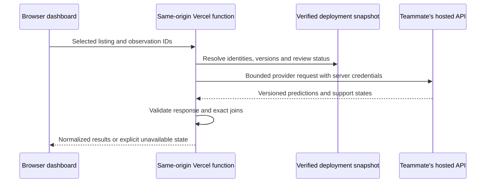

# Hosted prediction API integration design

Status: **proposed, not implemented**. The teammate will provide a hosted
prediction API; its URL, request/response format and authentication method have
not been supplied. No prediction route, provider credentials, scores or fitted
model are connected to the deployed workspace. This design supplements the
[model handoff](model-handoff.md) and existing
[application interfaces](../apps/web/lib/contracts.ts).

## Request flow

Add a provider adapter behind a proposed `POST /api/model/predictions` route.
The existing read-only collection routes remain the source of listings and
evidence. Initially request one selected product or the maximum four-product
comparison; bulk cloud predictions need a separately bounded batch design.
Camera rotation and trait-column changes never trigger prediction requests.

The proposed browser request contains `dataset_revision`, `dataset_version`,
`schema_version` and `items: [{listing_id, observation_id}]`. These names are an
application proposal, not an assertion about the teammate's API. The backend
checks versions against its own snapshot and resolves IDs before dispatch.
It constructs any required features from validated server data, retaining
attribute state, scope, unit and review status. Client-supplied feature values,
provider URLs and eligibility overrides are not accepted.

For a price-sensitive result, `observation_id` is required and must belong to the
specified listing. A future score-only operation may explicitly allow null when
its definition is independent of an observation; such a result cannot produce
an observed-price gap. Never select another observation silently or join by
product name, barcode similarity or array position.

## Provider configuration and execution

Use server-only Vercel environment variables: proposed names `MODEL_API_URL`
and, if needed, `MODEL_API_TOKEN`. The adapter applies the teammate's agreed
authentication scheme; it does not assume Bearer authentication. Credentials
never use a `NEXT_PUBLIC_` prefix or appear in browser responses, URLs or logs.
Keep Preview and Production configuration separate. Accept only the configured
HTTPS destination, disallow credential-bearing URLs, and reject redirects so
credentials cannot follow a response to another host.

Initial proposed application limits are four distinct listing/observation
pairs, an 8 KiB browser request, a 64 KiB derived provider request, a 512 KiB
provider response and an eight-second total deadline covering headers and body
consumption. Enforce byte limits while streaming, rather than trusting
`Content-Length`, and abort upstream work when its deadline or caller cancellation
fires. Send only required features and context, never the raw evidence archive.
These are design limits to confirm against the provider, not claims about its
current behavior. The existing 4 MB application-response ceiling still applies.

Use explicit user retry initially; no automatic retry or speculative calls on
hover. Default to `Cache-Control: no-store` until model versioning and provider
cost/rate limits are agreed. Any later cache key must include model identity,
input revision, dataset/schema/design versions, listing/observation pair and
prediction options. A warm-instance cache is not a shared rate limiter. Before
enabling a metered public integration, agree the provider quota and whether
access needs workspace authentication or a shared request limit.

## Response normalization and validation

The adapter maps the actual provider response into the semantic fields in the
[model handoff](model-handoff.md#proposed-model-output). Runtime validation is
required even when TypeScript interfaces or generated OpenAPI types exist.

| Boundary | Required check |
| --- | --- |
| Identity | Exact listing and observation pair from the requested set. Reject duplicates or unexpected pairs; represent an omitted requested result as unavailable, never as zero. |
| Input provenance | Inference dataset revision, silver dataset version and schema version must match the deployment and request. Keep training-data provenance separate; it cannot substitute for inference-input identity. Validate model/design compatibility explicitly. |
| Model identity | Nonempty model version, output timestamp and an explicit experimental/validated status. A validated label must have an agreed evaluation reference. |
| Price | Finite positive normalized price or null, with currency, quantity unit, regular/displayed/promotion basis, tax/timing context, transform and reported statistic. Do not interpret a log value as a currency price. |
| Interval | Null when absent. Otherwise require finite ordered bounds, units, interval kind and coverage level between zero and one. Distinguish prediction intervals from confidence intervals. |
| Score | Null when absent. Otherwise require a finite value, name, definition, direction, reference cohort and declared range; check any finite bounds. Do not invent a 0–100 scale. |
| Explanation | Null when absent. Otherwise validate the declared contribution space, baseline, signed contributions, feature mapping and explicit remainder; check reconciliation to the stated output using an agreed tolerance. |

Keep provider support separate from transport failure and local review status.
A supported result must contain at least one usable declared output. Unsupported
results carry reasons and null analytical values. Unavailable means no usable
result was obtained; it is not evidence that a product is unsuitable for a model.
Limit reason strings and explanation entries, and expose only normalized fields.

Proposed endpoint outcomes are 400 for malformed input, 404 for an unknown
listing/observation, 409 for a stale browser snapshot, 503 when the provider is
not configured, 504 for timeout, and 502 for upstream failure or invalid provider
output. A provider rate limit may map to 429 with a bounded retry delay. Use
stable error codes and safe messages, never upstream bodies or credential-bearing
diagnostics. Valid requests can return per-item unsupported/unavailable states.
The UI keeps the observed-data explorer usable through every model failure.

## Review and visualization rules

The pinned snapshot currently has **zero eligible model inputs** and is not
release-ready. Hosted availability does not change those facts. Preserve the
schema's missing states and current eligibility/review defaults; do not derive
eligibility from the existence of a prediction. By default, an unreviewed or
ineligible observation has no validated benchmark. Any
experimental preview must remain visibly experimental and preserve the original
review/eligibility fields; a browser request cannot opt itself into an override.

The existing model target is **log regular GBP per 100 g**; the current cloud
shows **displayed observed GBP per 100 g**. A price gap requires compatible
quantity, currency, promotion/regular basis, tax and timing context, with explicit
reasons when comparability is absent or unknown. The server checks available
observation evidence and the provider's declared basis; a compatibility boolean
alone is insufficient. Without compatibility, show the two labelled values
separately and omit the gap and any over/underpriced classification.

Use intervals only when supplied with their meaning. Use score colors only with
the score's actual legend and reference cohort. Currency contributions can form
signed currency layers; log contributions require a log-labelled view and cannot
be treated as additive GBP thicknesses. Back-transformation must preserve the
provider's stated statistic and any correction; exponentiating a log prediction
does not automatically yield a mean currency price. An explanation or observed
gap does not establish a causal trait premium. Keep the fictional 500-product
study separate from real provider outputs.

The approved future explanation is a family waterfall with a trait drill-down:
family order on X, up to four product lanes on Y, and cumulative price on Z (or
an explicitly labelled transformed target when that is the explanation space).
Provide a baseline and signed contributions keyed to stable schema trait IDs.
Map those IDs to the exact response-compatible schema families; aggregate only
additive contributions in the same space, keeping any unassigned remainder
explicit. Expanding a family must preserve its subtotal and the overall
baseline-to-prediction reconciliation. An observed-price marker and gap require
the compatibility checks above. Never sum raw trait values or convert evidence
coverage into a contribution. This waterfall is not implemented until the
provider contract supports it; the current family lens displays evidence only.

## Minimum teammate handoff and implementation order

Before wiring the route, obtain:

1. The hosted endpoint, HTTP method, authentication method, and one working
   request/response example or OpenAPI document. Put any secret directly into
   the agreed secure environment configuration.
2. Required feature/context inputs or ID lookup behavior; exact identity and
   inference-version fields; model version and experimental/validated status.
3. Target/score definitions, units, transforms, reported statistic, comparison
   basis, missing/unsupported behavior, and optional interval/explanation shape.
4. Expected latency, request/batch limits, rate limits, cost and timeout/error
   behavior. Confirm whether predictions are deterministic for a model version.

Then implement the server adapter and runtime validator, add contract fixtures
from the supplied examples, and exercise version/ID mismatches, unsupported
records, nullable outputs, malformed/oversized responses, timeouts and credential
isolation. Add the selected-product and comparison UI only after these checks
pass. Update shared interfaces and canonical documentation with the actual
provider contract, validate a configured Preview deployment, and record what
remains experimental. Until then this file is a design, not a functioning API.

## Temporary demo presentation

The user subsequently approved a clearly labelled fictional score presentation.
The optional `scoreMode=demo` analysis response supplies ID-seeded 0–100 scores
and additive family layers averaged by observed price band. These are not
provider outputs and do not implement this hosted model contract. The visible
chart badge, axis and contextual help identify them as demo values. Switching
to real outputs still requires the provider, version, basis, range and explanation
validation above; never silently substitute demo values for unavailable model
predictions. Observed gap and brand analyses do not consume demo scores.
