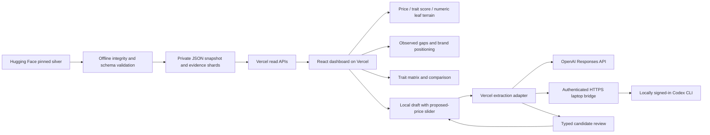

# Vercel application architecture

Design recorded before implementation on 2026-10-03 in response to the request to
use Vercel for both frontend and backend. Application root: `apps/web`.

The [preview](https://rgc-mgr5btzho-ptyyyy-s-projects.vercel.app) is deployed with
Vercel sign-in protection. The cleaned application passed 27 hosted route/asset
checks and eight Next.js asset checks; all seven API traces include the snapshot.
See the [lifecycle proof](lifecycle/plan.md#proof).

## Deployment and data flow

### Terrain and product-input revision

The primary view is an opaque layered 3D terrain. X is observed GBP/100g,
Y is a read-only trait-derived demo score, and Z is **one numeric leaf trait in
its original units**. Parent families are navigation only. Colour selects one
leaf enum, number, integer, boolean or string-list trait, grouped under its family
in the selector. There is no family aggregation or family height index. The
published schema has flat groups containing fields; no deeper taxonomy is inferred.

Enum values become layers. Numeric colour values use five equal-width ranges
calibrated from valid known values in the immutable whole snapshot, so filtering
does not change a value's category. The maximum belongs to the last range;
constant fields use one band. Unknown, conflict, not-applicable, truncated and
explicit empty-list states remain distinct. List values share one field's weight.
Category shares partition interpolated height above an explicit baseline into
coloured layers; thickness is not a causal contribution or model explanation.
The surface summarizes nearby observations; exact product coordinates stay fixed.
Increasing X/Y recedes from the default camera and increasing Z rises.

The same `trait-demo-1` recipe scores observations and configured products:
base 20, plus cocoa percentage × 0.30, plus 10 for each known-present organic,
fairtrade, bean-to-bar, single-origin and gift-pack claim. At least one recognized
input is required; missing claims are not treated as absent. The result is a
transparent prototype assumption, not an estimate of quality, demand or fair
price. Price and listing identity do not enter the recipe. The proposed-price
slider changes the draft's X coordinate only; validated traits determine Y/Z.
The product form separately serves the published LightGBM without brand
synthetic fixture. Its model predictions and SHAP values do not change the
terrain recipe or observed-price analysis.

One Next.js App Router application serves the page and same-origin collection APIs and extraction adapter. Vercel supports this full-stack deployment directly through its
[Next.js integration](https://vercel.com/docs/frameworks/full-stack/nextjs).
Use Node 24, an available
[Vercel runtime](https://vercel.com/docs/functions/runtimes/node-js/node-js-versions).
No database is needed for the initial immutable collection explorer. Server
functions never write files or invoke the processing pipeline. Dataset refresh
is an explicit local preparation step followed by a new deployment.

The product form calls `POST /api/predict-price`, which runs the immutable
synthetic LightGBM fixture directly in Node. Model files are verified during
preparation, build and runtime loading. No external inference credentials are
needed. Raw processing, model fetching and training run outside page requests.
The hosted preview recorded above predates this addition.

`scripts/build_web_snapshot.py` verifies the pinned manifest and all
required file hashes, loads that snapshot's four chocolate contracts, validates
every product using the existing schema validator, and derives the application
snapshot. The original source files remain in ignored `data/hf-snapshot/`.
The deployment includes `apps/web/snapshot/`, the application, verified
`apps/web/model-cache/` artifacts, public visualization assets and the supplied
packaging photos used as demo inputs. A generated manifest records hashes for
the derived JSON. Snapshot and model assets are bundled server-side; they are
never placed under `public/`.

## API contract

Shared TypeScript interfaces live in `apps/web/lib/contracts.ts`. Collection endpoints use GET; extraction uses POST. They return JSON and reject
unsupported or malformed inputs with explicit errors.
Missing listings return 404. Unexpected failures return a generic 500 response
without local paths or stack traces. JSON errors have `{error:{code,message}}`.

| Endpoint | Inputs | Output |
| --- | --- | --- |
| `/api/schema` | None | Snapshot metadata, schema contract, typed field catalogue, source counts. |
| `/api/products` | Cohort filters; `page` (default 1); `pageSize` (default 25, max 50) | Product summaries, total/page metadata and per-field coverage across the entire matching cohort. |
| `/api/products/[id]` | Exact listing ID | Product summary and original attribute/price evidence from its source shard. |
| `/api/analysis` | Cohort filters; `range=core` (default) or `full` | Full-cohort unit-price summary and brand medians; 20-bin histogram and gaps. |
| `/api/terrain` | Cohort filters; leaf `color`; numeric leaf `z`; `range=core|full`; `limit` (default 1000, max 2000) | Exact price/trait-score/Z rows, category shares, range/completeness counts and score definition. |
| `/api/extract-traits` (POST) | Description and/or up to two base64 images | Validated candidate traits with evidence and warnings; never writes observed data. |
| `/api/predict-price` (POST) | Five exact model keys and confirmed single bar pack scope | Synthetic unit/pack prediction, signed field SHAP, reference and reconciled price allocations; no interval validated on real products. |
| `/api/compare` | Comma-separated `ids`, maximum four distinct listings | Ordered product summaries for the trait matrix. |

Cohort inputs are `search`, `source`, `role` (`all`, `brand`, `retail`, `unknown`),
`status` (`all`, `priced`, `unpriced`, `conflicts`) and `rules` (a JSON array of at
most 12 AND conditions). A condition is `{field,operator,min?,max?,value?}`.
Operators: `known`, `unknown`, `conflict`, `not_applicable`, `reviewed`, `range`
for numeric/integer fields, and `equals` for enum/boolean fields. Numeric ranges
must be finite, in schema bounds, correctly ordered and integer where required;
at least one bound is required. Enum and boolean values retain their types.
No arbitrary source filenames, expressions or query languages are accepted.

The primary `/api/terrain` accepts leaf dimensions only. Parent family keys are rejected. Complete rows
require a usable observed GBP/100g price, at least one recognized scoring trait,
and a known valid Z value. Core-range bounds are computed before completeness
exclusions. The response discloses total, priced, complete, sampled and missing
counts; missing-score and missing-Z counts can overlap. Stable ID sampling runs
after completeness filtering. Incomplete listings remain in the matrix.

The browser retrieves one product page, compact plotted coordinates and selected
evidence. It never receives the entire collection index. This also keeps
responses below Vercel's
[4.5 MB function payload limit](https://vercel.com/docs/functions/limitations).
The implementation enforces a conservative 4 MB serialized-response ceiling.
Deployment-local GET responses may be cached briefly by Vercel; metadata includes
the exact dataset revision. No live third-party request is needed on page load.

## Frontend behavior

A dark mint/lilac dashboard combines the layered terrain, schema-driven cohort
controls, expandable family matrix, four-listing shortlist and source evidence.
Piece of Cake Pricing / FMCG Pricing made easy remains the title/subtitle;
contextual question-mark controls contain explanations. The visible TRAIT SCORE ·
DEMO label and errors/status remain on-page.

Family cards navigate member traits and show full coverage breakdowns on
hover/focus/tap. Each leaf offers Filter and, if compatible, Colour layers or
Height. Selecting Filter opens a typed condition for explicit addition to the
cohort. Parent cards never become terrain colour layers. Legend buttons toggle
layer emphasis independently. Matrix display filters/pins do not change data.

`TerrainViewport` builds a 24 × 24 grid with positive compact smoothing weights,
leaves unsupported cells open and renders opaque closed meshes. It keeps at most
eight named layers plus Other, retaining evidence-state groups. Layer order is
weighted median Z then key. A baseline of min(0, minimum observed Z) allows raw
negative traits. Smoothing cannot overshoot the local observed Z range. Raw
products retain their exact price/score/Z, independent of smoothing.

The renderer serializes and coalesces updates. Geometry construction occurs
inside the queue and waits until pointer release. Camera relayout never rebuilds
data. Draft, selection, gap and highlight updates use separate lightweight
commands; a proposed-price change only updates the draft trace and display bounds.
Data axes retain their original calibration. No autorotation; pixel ratio is
bounded. A 2D projection mode and keyboard product picker preserve exact values
when WebGL is unavailable. Live GPU performance still requires browser review.

The local product configurator accepts proposed GBP pack price, edible mass and
schema-validated traits. Explicit listing-copy/reset actions preserve edits across
selection changes. Only known untruncated attributes are copied; copied price
and mass use the same observation. Image/text extraction returns reviewable
candidates, never silently changes the draft. Applying checked candidates merges
into the latest draft and preserves price. Changed inputs cancel stale requests;
copy/reset discards stale review state. Score is read-only and trait-derived.
Invalid price/mass/traits suppress the marker; missing Z prompts for that trait.
Out-of-range drafts extend display bounds without changing observed statistics.
Source evidence remains under a disclosure; drafts are not persisted or trained on.

The extraction panel offers **Use example photos** for the front and back of
Well&Truly Fudge & Brownie Oat M!lk Chocolate, 30 g. Their original JPEG bytes are
repository demo assets in `apps/web/public/examples/well-and-truly/`. Selection
loads both images for preview and clears the description after preparation
succeeds; a separate **Extract traits** action submits the current inputs. The
example supplies no prefilled candidates. Users can also add or remove their own
PNG/JPEG/WebP images, up to two at once. Uploads append when room remains and
replace the selected pair when two are present. Each original must be readable
and at most 20 MiB and 40 megapixels. Browser preparation resizes as needed to a
longest edge of 2,400 pixels and compresses each image to at most 1 MiB. It creates temporary
copies while preserving the original sample files. The public asset manifest
pins both originals by SHA-256 and the asset verifier checks them during build.

Core uses full-cohort Tukey price fences and reports omitted tails; Full includes
all usable prices. Zero IQR falls back to Full. Gap selection highlights an exact
price interval on the terrain floor and 2D projections. The primary dashboard requests observed-price analysis from `/api/analysis`.

Gap finding requires at least 20 in-range priced listings and five distinct
in-range prices. It returns interior sequences of empty bins bounded by occupied
bins, ordered by width, with counts in the immediately adjacent occupied bins.
These are observed absences at the selected bin resolution, not demand or
recommended selling prices. Brand analysis ranks brands with at least three
priced listings by median GBP/100g, compares that median to the full-cohort
median, and counts prices strictly outside the full-cohort 1.5 IQR fences.
Quantiles use R-7 linear interpolation, equally weighting source listings.
Unknown brands remain in totals but not rankings. At most 30 brand rows are
returned with exclusion/truncation counts. Higher price positioning does not
measure sales, margin, quality, causal premiums or a fitted model residual.

Several families can remain expanded in the matrix and shortlist, sharing a
per-family detail limit, trait search and pinned fields. Collapsed summaries use
all schema traits even when display filters hide individual fields. Pinned
traits appear once. Known/unknown/conflict/not-applicable remain distinct, and
summary clicks open relevant family evidence. Coverage is not price influence.
Compatible signed model contributions are still required for a real price
waterfall; terrain layers and prototype scores are not those outputs.

Cancel stale API responses, hide old results during cohort changes, provide
loading/empty/error states, and respect reduced motion. The 2D fallback and product picker support use without a GPU context. Live browser layout validation is
separate from API/controller tests and a successful build.

Unknown, conflicting, not applicable and known values remain distinct; unknown
is never converted to zero or false. Latest dated observations outrank undated
observations. Same-time conflicting latest prices are not plotted as a single
price. GBP per 100g uses edible weight from the same observation. Observed data
does not imply verified claims, a fitted fair-price line, or model eligibility.

## Image/text extraction and local Codex bridge

`POST /api/extract-traits` accepts JSON
`{description,images?:[{mimeType,data}]}`. The legacy single `image` input is also
accepted. Description is bounded to 12,000 characters; up to two PNG/JPEG/WebP
images use matching signatures and canonical base64. The server accepts at most
2 MiB per image and 2 MiB of decoded image bytes in total; browser preparation
targets at most 1 MiB per image. The total JSON request body cap is 3,000,000
bytes. Requests
with a foreign Origin are rejected. Responses are no-store. Validation uses the
snapshot's allowed keys, types, vocabulary, numeric bounds and short supporting
evidence. Output is `{provider,model,traits:[{key,value,evidence}],warnings}`.
Invalid candidates are omitted with warnings; duplicate keys and malformed model
responses fail. Source identity is not fabricated and no extraction result changes
reviewed/model-eligible status or the immutable snapshot.

Both provider adapters receive every submitted image. Extraction instructions
preserve qualifiers and component scope: the example's 43% minimum cocoa claim
for its chocolate component cannot become an exact whole-product cocoa value,
and “fairly traded” cannot establish a named Fairtrade certification. Candidates
still require user review. These photos and user uploads do not enter the
collection snapshot or training corpus, and missing recognized scoring traits
leave the existing demo score unavailable.

The default `openai` provider uses server-only `OPENAI_API_KEY`, optional
`OPENAI_EXTRACTION_MODEL` (default `gpt-4.1-mini`), Responses API with image inputs,
strict structured output and `store:false`. It uses a 45-second timeout. See
[image inputs](https://developers.openai.com/api/docs/guides/images-vision) and
[Structured Outputs](https://developers.openai.com/api/docs/guides/structured-outputs).

Set `TRAIT_EXTRACTOR_PROVIDER=codex`, `CODEX_EXTRACTOR_URL` (HTTPS `/extract`) and
`CODEX_EXTRACTOR_TOKEN` to use a laptop instead. The Vercel adapter has a
100-second timeout, a 120-second function budget and validates the bridge result
again. It never receives or forwards ChatGPT OAuth credentials. Missing provider
configuration returns 503, never invented extraction results. The adapter admits
at most two active requests per instance; this is not global rate limiting.

`npm run extractor:local` binds only `127.0.0.1:8787` and invokes the installed,
signed-in Codex CLI. The bridge checks a long bearer token, permits one request,
bounds the body and whole operation (90 seconds), creates private temporary input/
output files and removes them afterward. CLI execution uses a disposable cwd,
read-only sandbox, no approvals, no user/project rules, no MCP/tool browsing or
shell tools, and schema-constrained output. Existing auth paths remain unchanged;
API key environment variables are removed from the child to use local sign-in.
Images/descriptions are untrusted evidence, not instructions. No request content
or credentials are logged by the bridge. Codex inference still runs through the
user's service account and subscription usage limits; this is not an offline model.
See [Codex authentication](https://learn.chatgpt.com/docs/auth) and
[non-interactive mode](https://learn.chatgpt.com/docs/non-interactive-mode).

A private Tailscale address alone is not reachable from ordinary Vercel Functions.
[Tailscale Funnel](https://tailscale.com/docs/features/tailscale-funnel) can expose
the token-protected localhost bridge over HTTPS. The laptop must stay awake,
connected and signed in. No tunnel is currently published. Setup commands and
Vercel environment variables are in [the app README](../apps/web/README.md).

## Validation and remaining proof

The real default terrain has 289 complete core-range rows from 3,743 matching
listings and 892 usable prices; 81 prices are above the core range. Missing score
and Z counts are disclosed, and raw snapshot eligibility remains zero. The app's added test fixtures and retired compatibility routes have been removed
at the user's request. Current validation uses TypeScript, production compilation,
asset/data verification and hosted HTTP checks, recorded in the lifecycle plan.

Local browser checks verified example selection, custom upload and resizing of
both original JPEGs, removal/appending, the two-image limit and preservation of
draft name and price. Extraction reached the API and displayed the expected 503
for missing provider configuration. This photo-input revision has not been
deployed; the hosted preview above retains the earlier version. Terrain/WebGL
interaction still requires browser review.

A synthetic live Codex extraction previously failed before contacting a model because its
in-process app-server could not initialize (`Operation not permitted`). Live laptop extraction and an authenticated tunnel remain to
be verified. No API key has been provisioned by this change. These limits are separate from the locally connected synthetic price demo.
The new prediction endpoint and form still need a hosted deployment.

## Synthetic pricing function

[The serving guide](data/analysis/web-fixture-pricing.md) defines
`POST /api/predict-price`. Its original fixture model and manifest are downloaded
at an immutable revision into ignored `apps/web/model-cache/`, verified by hash
and identity, and included in the Node function trace. Prebuild prepares missing
model artifacts through a bounded Node download, so clean Git deployments can
materialize them without Python. Cached builds verify existing bytes offline. No Python or external
inference service runs on requests. Thirty-two coalitions evaluate exact
stored-path SHAP for five fields, matching native LightGBM 4.6.0 contributions.
Runtime reconstructs the raw prediction and reconciles signed field/family
allocations with the model reference. The form presents synthetic prices,
raw SHAP and pounds/percentages using the documented allocation convention.
Excluded schema fields are explicitly not modeled. Model input edits hide stale
results, while proposed price edits never enter the model. The prediction form
is connected locally; the existing protected preview requires a new deployment.
